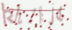

# captcha-recognition
### CREATE DATASET ###
  - Install ImageCaptcha: ```pip3 install captcha ```
  - Create dataset: ```python3 create_dataset.py``` <br /><br />
   kh1kjs <br />
   8kxqyc <br />
   tjjzbu
### TRAINING ### 
  - Change lr, batch size, no.epoch, data directory, description, etc in ```config.py``` 
  - Run training: ```python3 training.py```
### TESTING ### 
  - Choose directory to decode ```img_dir``` and the description ```description_path``` in ```config.py```
  - Run testing: ```python3 testing.py```
### Prediction ### 
  - Predict text for an image
  - Run: ```python3 predict.py```

### RESULT ####
  Data was created by myself and was used for a research competition on Kaggle:
  https://www.kaggle.com/c/aif-challenge2/
  - Publict test: 91.25%
  - Private test: 78.66%
